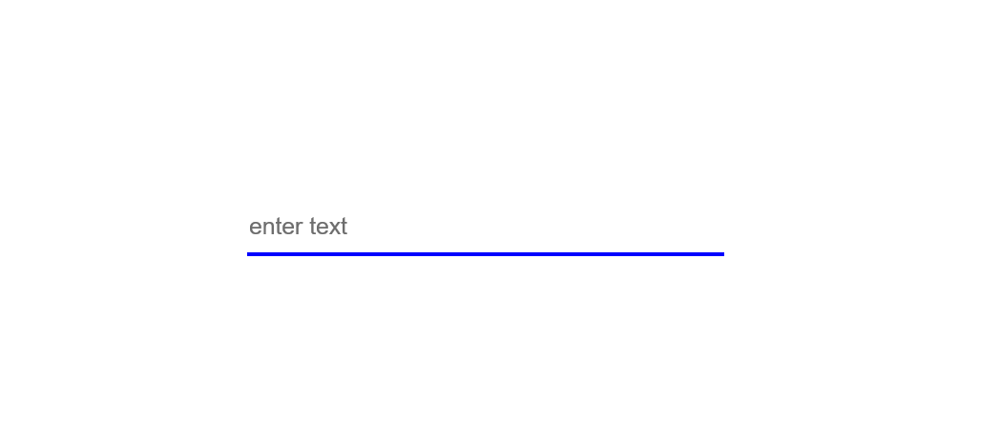
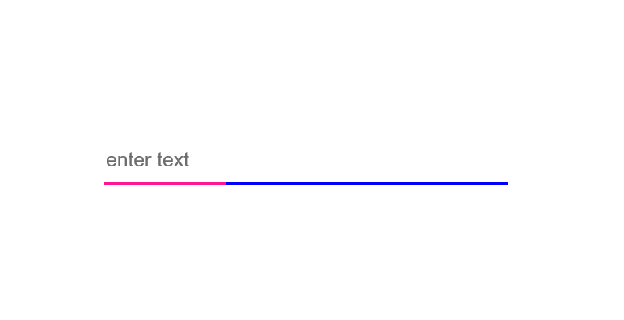
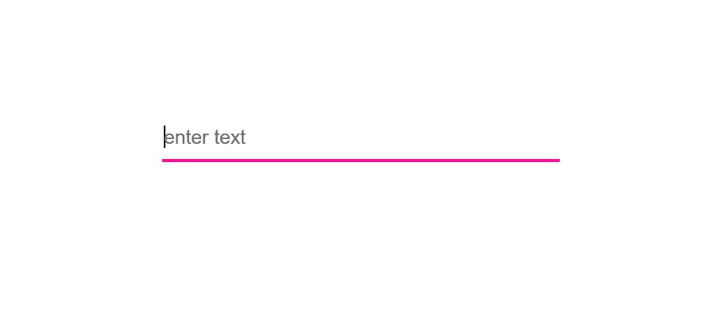

# input_text-animation

<h2>if you want to take a look of the 'input animation' how is work, you can visit my codepen account.
so click the icon 👉👉
👈👈</h2>

### Before animation  

  
  
### When you click in the animation start  

 

  
  
### End animation  

